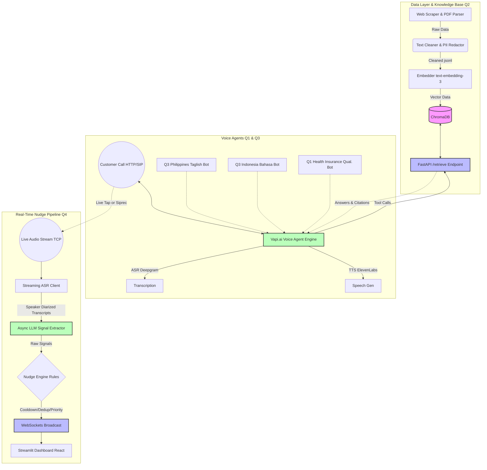

# AI Voice Agent Assessment: System Architecture

The following diagram illustrates the interactions between the 4 major architectural components of our solution (Q1, Q2, Q3, and Q4).

You can view this diagram gracefully rendered directly in GitHub, or by pasting the code below into [Mermaid Live Editor](https://mermaid.live).

